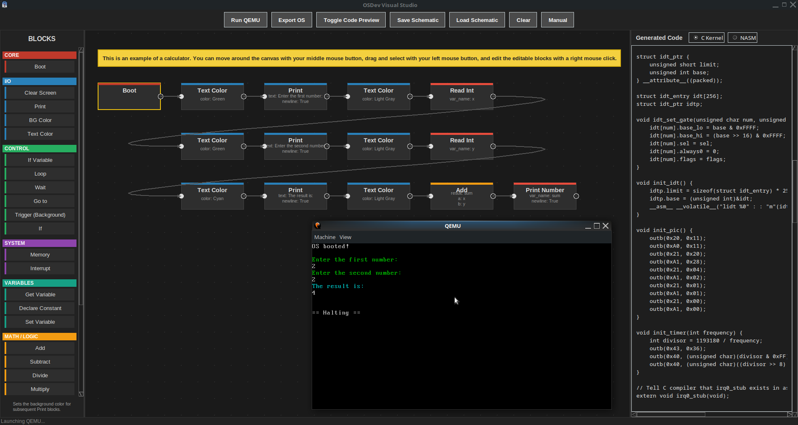

# OSDev Visual Studio
<p align="center">
  
</p>

A visual scripting language for OS development. Drag blocks, connect them, and generate a real, bootable C kernel or NASM assembly that runs in QEMU. No deep C or Assembly knowledge required to start learning how an Operating System works.

### DISCLAMER
**This project was created with AI**

## Features

- **Visual Node Editor:** A drag-and-drop canvas with an infinite pannable workspace, multi-select, copy/paste, and grid-snapping.
- **Real-Time Code Generation:** See the C or NASM code generate live as you build your graph. Click a block to highlight its corresponding code.
- **Hardware Integration:** Generated C code includes a real VGA text mode driver, IDT/PIC setup for hardware interrupts, a PIT timer for background tasks, and keyboard polling.
- **QEMU Launch:** Compile and boot your OS in QEMU directly from the app with a single click.
- **Schematic Saving:** Save and load your visual OS designs as `.schematic` files.
- **Modular Block System:** All blocks are defined as simple Python files in the `blocks/` folder. Add your own without touching the core application code!

## Dependencies

To run the application and compile the generated OS, you need the following dependencies installed on your system.

### 1. Python Environment
- **Python 3.x**
- **Tkinter:** Usually included with Python, but on some Linux distributions, you may need to install it manually:
  ```bash
  sudo apt install python3-tk
  ```

### 2. OS Development Toolchain
To compile the generated C and Assembly code into a bootable kernel, you need the standard GCC/binutils toolchain and NASM.
- **GCC (C Compiler):** Must support 32-bit compilation (`-m32`).
- **GNU LD (Linker):**
- **NASM (Assembler):** For the Assembly generation mode.
- **Multilib packages (Linux):** If you are on a 64-bit Linux system, you need 32-bit libraries to compile 32-bit code.
  ```bash
  sudo apt install build-essential gcc-multilib nasm
  ```

### 3. Emulation & ISO Creation
- **QEMU:** Used to boot and run the generated kernel (`qemu-system-i386`).
- **GRUB & XORRISO:** Required only if you want to use the generated `iso.sh` script to create a bootable CD-ROM image.
  ```bash
  sudo apt install qemu-system-x86 grub-pc-bin xorriso
  ```

## How to Run

1. Ensure all dependencies above are installed.
2. Open a terminal in the project root directory.
3. Run the application:
   ```bash
   python main.py
   ```

## Controls

- **Add Block:** Click and drag a block from the left sidebar onto the canvas.
- **Move Block:** Left-click and drag an existing block.
- **Pan Canvas:** Click and drag with the Middle Mouse Button.
- **Snap to Grid:** Hold `Alt` while dragging a block to snap it to the 40px grid.
- **Multi-Select:** Left-click and drag on an empty area of the canvas to draw a selection box.
- **Connect Ports:** Click and drag from an output port (right side) to an input port (left side).
- **Edit Properties:** Right-click a block to edit its properties (variables, text, colors, etc.).
- **Delete:** Select a block or connection and press `Delete` or `Backspace`.
- **Copy/Paste:** Select block(s), press `Ctrl+C`, then `Ctrl+V`.
- **Toggle Code Preview:** Click the "Toggle Code Preview" button in the top toolbar to show/hide the generated code panel.

## Blocks

### Core
- **Boot:** The entry point of the OS. Initializes VGA and starts execution. (Only one allowed).

### I/O
- **Print:** Outputs text to the screen using VGA text mode.
- **Text Color:** Sets the foreground color for subsequent Print blocks.
- **BG Color:** Sets the background color for subsequent Print blocks.
- **Clear Screen:** Wipes all text from the screen.

### Control
- **Loop:** Repeats the execution flow connected to its 'body' port N times.
- **If:** Branches execution based on a true/false condition.
- **If Variable:** Branches execution by comparing a variable to a value.
- **Go to:** Jumps execution directly to the block connected to its output.
- **Trigger (Background):** Runs independently in the background via the hardware timer interrupt. Executes its chain continuously while the main OS runs.
- **Wait:** Pauses OS execution for a specified number of CPU cycles.

### System
- **Memory:** Allocates or frees a block of memory.
- **Interrupt:** Registers an Interrupt Service Routine (ISR).

### Variables
- **Declare Constant:** Declares an integer variable with an initial value.
- **Set Variable:** Updates an integer variable with a value.
- **Get Variable:** Placeholder block to remind you a variable exists.

### Math / Logic
- **Add / Subtract / Multiply / Divide:** Performs math operations. Result is stored in a variable.
- **Compare:** Compares A and B using an operator. Result is 1 (true) or 0 (false).

### I/O (Hardware)
- **Read String:** Reads a string from the keyboard into a variable.
- **Read Int:** Reads an integer from the keyboard into a variable.
- **Print Number:** Prints the value of an integer variable to the screen.

### Advanced
- **Custom Code:** Allows you to type raw C or Assembly code. Double-click to edit.

### Misc
- **Comment:** A sticky note for reminders. Does not generate code. Scales to fit your text.

## How Variables Work

Variables are dynamically scoped to the entire `kernel_main` function. You do not need to explicitly declare variables before using them in Math blocks.

1. Use a **Read Int** block and set its `var_name` to `x`.
2. Use a **Math Add** block. Set `a` to `x`, `b` to `5`, and `result` to `total`.
3. Use a **Print Number** block and set its `var_name` to `total`.
The generated C code will automatically declare `int x = 0; int total = 0;` at the top of the function and execute the logic seamlessly.

## Exporting & Building the OS

1. Click **Export OS** in the top toolbar.
2. Choose a folder to save your project.
3. The app will generate:
   - `kernel.c` (or `.asm`)
   - `linker.ld`
   - `build.sh` (Compiles the code)
   - `run.sh` (Launches QEMU directly)
   - `iso.sh` (Creates a bootable ISO file)
   - `README.md` (Instructions)
4. Open a terminal in that folder and run:
   ```bash
   chmod +x *.sh
   ./build.sh
   ./run.sh
   ```
